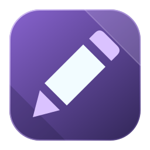

<p align="center">
  
</p>

<h1 align="center">IcyDraw</h1>

<p align="center">
  <strong>A modern, cross-platform ANSI & ASCII art editor</strong>
</p>

<p align="center">
  <a href="https://github.com/mkrueger/icy_tools/releases"></a>
  <a href="https://github.com/mkrueger/icy_tools/blob/master/LICENSE-MIT"></a>
  <a href="https://github.com/mkrueger/icy_tools/actions"></a>
</p>

---

## Frontend Migration

See the [changelog](changelog.md) for release changes.

The normal `icy_draw` binary now uses egui/eframe with the shared wgpu terminal
renderer used by IcyTerm, IcyView, and IcyMail. The `icy_draw_egui` alias is also
available. Original drawing icons, bitmap glyphs, painting helpers, document
formats, undo operations, font loading, Lua plugins, and the MCP HTTP server are
reused.

```sh
cargo run -p icy_draw -- art.icy
cargo run -p icy_draw -- --mcp-port 8080
cargo run -p icy_draw -- host --bind 127.0.0.1 --port 8000 art.icy
```

Changing a color, tool, or function-key character set keeps keyboard input on
the drawing canvas, so you can continue typing without clicking it again.
Text and numeric entry fields temporarily take keyboard input while focused.

### Selecting matching cells

The **Select** tool retains its Rectangle, Character, Attribute, Foreground and
Background modes and adds **Look**. Click a cell in Look mode to select cells
displaying the same solid color: a space on black, a black full block, and
black-on-black text can match even though their stored characters differ.
Matching uses the document's bitmap fonts, font slots, palette and 8/9-pixel
spacing, rather than assuming CP437 glyph shapes. Cells that are not a solid
color, styled cells, and Unicode text use exact character-and-attribute matching.
Transparent cells are not treated as opaque black.

For any matching mode, open **Matching** in the tool options:

- **Connected only** limits the selection to edge-connected matches; diagonal
  contact does not connect regions. Off selects matches everywhere.
- **Sample merged** samples the visible text composite, including layer offsets
  and transparency. Off samples the current layer. This does not select pixels
  in Sixel images, and subsequent drawing still edits only the current layer.

Both options are off by default, preserving the existing literal selection
behavior. Shift-click adds matches, Ctrl/Cmd-click removes them, and a plain
click replaces the selection. Each click is one undo/redo step; selections
continue to constrain drawing, filling, copying and deletion.

### Layer groups

Select a layer and click the **Group layer** folder button below the layer list,
or choose it in the layer's context menu. This wraps the layer without merging
it; group an existing group to nest it. Groups support up to 64 nesting levels.

**Drag and drop** rows in the layer panel to reorder layers and groups; a group
moves with its contents. A line shows where the item will land. Dropping on the
middle of a group row (highlighted with a frame) puts the item at the top of
that group. Below the lowest item of a group, move the pointer left of its
indentation to drop after the group instead of inside it. Escape cancels a drag.
**Move into group** and **Move out of group** in the context menu do the same.

- The triangle or a double-click collapses/expands a group. Connector lines show
  the nesting, like the threads in IcyMail.
- The eye hides the entire subtree without changing children's visibility.
- **Properties** of a group edit its name, offset, visibility and position lock.
- Select a group and Ctrl/Cmd-drag on the canvas to move its members together,
  or change its offset in **Properties**. A position-locked member prevents
  moving the group.
- Raise/lower reorders complete subtrees among siblings. Duplicate copies the
  subtree; delete removes it. **Ungroup** keeps the children and their current
  appearance. A hidden group's children remain hidden when ungrouped.
- Adding or pasting a layer while a group is selected puts it inside that group.
  Select a child layer for painting, text editing or layer effects.
- Group operations, including every drop, support undo/redo. Groups are
  pass-through containers: they do not isolate blending or apply group-wide effects.

Save as **`.icy`** to preserve groups, membership and collapsed state. Grouped
documents use native format version **5**; older readers reject them. Flat
exports use the visible composite. Creating groups, dragging layers and moving
them between groups is unavailable during collaboration, floating paste or font
editing; edit-locked layers cannot be dragged.

### Non-destructive layer effects

Right-click an unlocked layer (including a text layer) and choose **Layer Effects**:

- **Palette remap** maps each of the 16 standard palette slots to another slot
  on that layer. Use individual mappings, Grayscale, Rotate hues, or Random hues.
  Hue presets preserve dark/bright pairs and leave black and neutral colors
  alone. Direct RGB and extended-palette colors are unchanged.
- **Hide selection** creates a mask hiding selected cells; **Keep selection only**
  hides everything else in the layer. Both replace the previous mask. Masks use
  layer-local coordinates, so they move with the layer; flips and cropping also
  transform them.
- Disable the remap or mask to see the original again, or remove the effects.
  The preview does not change the document until **OK**. **Cancel** discards it.
- **Bake into cells** commits the current effect into ordinary cells and removes
  its editable settings. This is undoable. Merging layers bakes their effects;
  stamping bakes the destination's effects but retains the source's settings.
  Copy/paste transfers the selected layer's affected cells, not its effect recipe.

Drawing continues to change the source cells under these effects. A mask does
not erase hidden content or replace the drawing selection. Sixel image layers
do not support these cell-based effects. **Look** selection uses the affected
appearance; literal character and color matching still use the source cells
unless **Sample merged** is enabled.

Save as **`.icy`** to retain the original cells, mappings and masks (including
disabled effects). Documents using effects require native format version 3;
older readers reject them instead of silently dropping the effects. Documents
without effects retain their existing format version. Flat exports such as ANSI
and XBin carry the rendered result, not the editable effects.

### Text layers

With a TheDraw font in the **Font** tool, text is typed into editable text
layers, as in the text tool of an image editor:

- Click outside a text layer to place a caret as tall as the font; the first
  typed character creates a text layer there. **New text layer** in the tool bar
  starts one at the caret, even on top of an existing text layer.
- Click inside a text layer to edit it, with the caret placed at the clicked glyph.
  Type, paste, press Enter for a new line, and use Backspace, Delete, the arrow
  keys, Home and End. Characters without a glyph in the font are left out;
  opposite-case glyphs are used when available. The view follows the inline
  caret, including its font height. Input exceeding the text or layout limits
  leaves the previous text unchanged.
- Escape, another tool, or a click elsewhere ends editing. A text layer left
  empty is then removed.
- A dashed frame marks the text layer the tool settings apply to. Ctrl/Cmd-drag
  moves the text layer under the pointer.

While a text layer is selected, the tool bar shows its font (with a preview of
the embedded font), outline style, letter and line spacing. Changing them, or
choosing a font in the font dialog, changes that layer. Without a selected text
layer, the preview shows the tool's font. Block and outline fonts are drawn in
the drawing colors: selecting such a text layer with the Font tool shows its
colors as the drawing colors, and choosing other colors recolors it. Color fonts
keep their glyph colors. A typing session is one undo step; creating the layer
and each settings or color change are steps of their own. Undo/redo refreshes the
drawing colors. Undo/redo changes to the layer stack end editing of the current
layer and leave a new, empty draft at the same position, so further typing cannot
target a different layer accidentally. FIGlet fonts still type directly into the cells.

Double-click a text layer in the layer panel, or right-click it and choose
**Edit text**, to edit it. The font is embedded in the document, so editing does
not depend on the original font file still existing.

Text layers are read-only for ordinary painting. Duplicate, reorder, mask and
recolor them like other layers, or move them with Ctrl/Cmd-drag or the layer
properties. Choose **Bake into cells** in the layer menu before painting or
transforming their cells. Baking text retains layer effects; baking effects or
merging layers also flattens the text. Baking supports undo/redo.
Cropping the canvas moves text layers with the cropped origin without deleting
their text. Resize-with-layer-clipping and global cell conversions require
baking first.

Save as **`.icy`** to keep the editable text and embedded font. Text layers use
native format version **4**, which older readers reject. Flat exports and
clipboard copies contain the rendered cells. Crash recovery retains text layers.
They are unavailable during collaboration, floating paste, or TheDraw font
editing, where the Font tool types into the cells. Text is limited to 64 KiB, a
1 MiB embedded font, and a 1000-by-20000-cell layout; spacing accepts 0–32 cells.

### Editing bitmap fonts

Bitmap font operations respect the active panel. With the character set focused,
**Inverse** and **Clear** affect every selected character (a linear range, or an
Alt-drag rectangle). Without a range, they affect the character at the cursor.
With the pixel editor focused, they affect only the current character's selected
pixels, or the whole character if no pixels are selected. A multi-character
operation is undone or redone in one step.

The active panel has a highlighted heading and border. The status bar shows the
character-selection count or pixel-selection dimensions, and **Inverse**/**Clear**
menu labels describe their current target.

For 8-pixel-wide fonts, choose **View → 8/9-Dot Cell Mode**, press **F8**, or
click **8px/9px** in the status bar to switch VGA display width. The glyph grid,
character set, tile view, and both previews reflect the mode. The ninth column
is not editable: CP437 characters `0xC0`–`0xDF` repeat their rightmost pixel,
while other characters leave it blank. This is a display option; saved glyphs
remain 8 pixels wide and switching modes does not mark the font modified.

The **Live Preview** toggle shows a resizable sample-text panel below the editor,
without leaving the glyph grid. Enter custom CP437 text or choose alphabet,
box-drawing, or block/shading samples, then view them at native size or 2×.
The preview updates as glyphs, dimensions, colors, or undo/redo change; editing
sample text does not modify the font. Unsupported characters are shown as `?`
with a warning. Samples wrap at 64 columns and display up to 16 rows, with a
warning if more text is present. The existing full **Preview** and tile view
remain available.

### Importing bitmap fonts

Choose **File → Import Font…** from the drawing or bitmap font editor to preview
and import native bitmap fonts (PSF, YAFF, raw DOS fonts), embedded XBin fonts,
or PCMag FontEdit/Fontraption DOS COM fonts. XBin files with two fonts let you
select which one to import.

You can also convert a 16×16 glyph-sheet image with optional dithering, or
rasterize a TrueType/OpenType font using CP437 character mapping. Set the target
glyph dimensions before importing; the bitmap editor supports widths up to
8 pixels and heights up to 32 pixels (TrueType requires at least 4×4).
The imported font opens as a new bitmap font document, without overwriting the
source file. Unsaved edits in the current document require save/discard
confirmation before it is replaced.

### Exporting bitmap fonts

In the bitmap font editor, choose **File → Export Font…** (Ctrl+Shift+E, or
Cmd+Shift+E on macOS). The dialog previews the font and exports PNG/BMP
16×16 glyph sheets, PSF, raw DOS bitmap fonts (`.fXX`, based on glyph height),
YAFF, ANSI files containing a CTerm DCS font upload sequence, or Fontraption
DOS COM fonts (non-TSR or TSR for 40-column, 80-column, or all text modes).
Existing files require overwrite confirmation. Exporting does not change the
font's save path or mark unsaved edits as saved; **Save** continues to use PSF.

### Image import

Choose **File → Import…**, **Import…** in the New File dialog, or its
welcome-page tile to convert a picture into a new ANSI, RIP, IGS, PETSCII or
VT52 drawing. Choose an image or drop one onto the dialog. The source and the
rendered result are shown side by side (or stacked when that shows them
larger) next to the settings. Local conversion needs no AI account or network
connection.

For ANSI, PETSCII and VT52, **Draw with AI** asks the configured Copilot model
to author semantic character art instead of matching pixels; **Stop** cancels
the request. The selected crop and fit are sent as a picture alongside the
native editor's drawing guidance and face/composition skills. The AI starts on a
blank native canvas; local pixel-matching tools are disabled for this request.
Its rendered result replaces the preview, marked **AI drawing**, before
**Accept**, not afterward in chat. The current document and chat conversation
remain untouched. If the request fails or returns no drawing, the error is shown
and the preview returns to the local conversion without the AI marker. Changing
a setting discards an AI drawing in favor of a new local preview. This requires
Copilot and a selected model, uses an AI request, and generated artistic
quality varies by model and source. Opening the import dialog checks Copilot
once in the background; if Copilot is not ready, **Draw with AI** explains why
(missing CLI, sign-in or connection errors). If sign-in is missing, run
`copilot login` in a terminal and reconnect in the AI chat settings. Local
conversion remains available without Copilot.

Local-conversion controls:

- **Scene** favors coherent hues with stronger tone/detail contrast; **Shaded**
  uses eight tone bands and a stronger penalty against high-contrast shade
  texture. Both emphasize color before ANSI palette reduction and use the
  shared perceptual converter, not an image-generation model.
- Start with **80 × 25** or **80 × 50**, or choose custom columns and rows
  (up to 160 columns, 200 rows and 8,000 cells; full-glyph matching has an
  additional work limit).
- **Crop** fills the target, **Contain** preserves the selected picture with
  margins, and **Stretch** fills it without preserving proportions. Drag on
  the source to select a focus area; **Reset focus** restores the whole image.
  The blue outline shows the actual converted area and the rest is dimmed.
- **Drawing** explicitly selects **Half blocks**, **Blocks and shades**,
  **All CP437 glyphs**, or **ASCII**. ASCII uses only printable characters
  (32–126), retaining ANSI colors and the Scene/Shaded and fit controls.
  Half blocks use independent upper/lower colors, with no
  shade or text glyphs. It area-samples a true columns × twice-rows pixel grid
  in linear light, sharpens at that grid's scale and encodes each pair using
  legal foreground/background colors. Selecting it disables tone banding and
  enables optional, gentle Oklab-lightness dithering, without shifting hue.
- Choose iCE colors, 9-pixel cells and DOS aspect ratio. Expand **Tone and style**
  for brightness, contrast, detail contrast, saturation, shade texture, neighbor
  consistency and tone intervals. Detail contrast enhances nearby lightness
  differences before reducing to the ANSI palette.
- Hue guidance allows gray/brown shade blends for skin and handles the two
  sides of a color boundary separately. All-glyph conversion avoids decorative
  glyphs in smooth areas, while preserving exact matches and edge detail.
- The preview updates in the background shortly after settings stop changing,
  showing the actual rendered result. While it is recomputed the previous
  preview stays dimmed and cannot be accepted.

**Accept and edit ANSI** opens the result as a new, unsaved ANSI document and
leaves other editor modes. Existing unsaved work requires Save/Discard/Cancel
confirmation. Cancelling the import leaves the current document untouched.

Supported sources are PNG, JPEG, BMP and WebP, up to 20 MiB, 8,192 pixels per
edge and 32 megapixels. EXIF orientation is applied. The source used for
conversion is reduced to a maximum 1,024-pixel edge; the dialog reports when
this happens. These controls improve experimentation, but do not guarantee
hand-drawn quality or parity with AINSI.

### AI drawing assistant

The right-sidebar icon at the far right of the menu bar toggles a resizable AI chat panel in every
editor mode of `icy_draw` / `icy_draw_egui`, laid out like the VS Code chat: the
conversation fills the panel and the message composer sits at the bottom. This first
version gives advice only with OpenAI-compatible servers; with GitHub Copilot it can
also propose drawings that you preview and apply (see below). It never runs scripts,
saves files or uses the MCP server. The legacy frontend does not include this panel.

The gear button opens the connection settings (they are shown automatically until a
server is configured). Choose **OpenAI-compatible** or **GitHub Copilot** at the top.
For an OpenAI-compatible server, enter its API base URL (including `/v1`
where required) and optionally an API key — for example
`https://api.openai.com/v1`, or `http://localhost:11434/v1` for a local Ollama
server — then choose **Connect**. On success the settings close and the chat is
shown. Click the compact model name in the composer's bottom toolbar to open the
model menu (or enter a model ID manually
in the settings if discovery is unsupported); **Manage connection…** at the end of
that menu returns to the settings. The server must support
`POST /chat/completions` with non-streaming text responses; discovery uses
`GET /models`. Remote connections require HTTPS; plain HTTP is limited to
loopback addresses. Redirects are not followed.

#### GitHub Copilot

Choose **GitHub Copilot** at the top of the connection settings to use your Copilot
plan (including Copilot Free) through the official
[Copilot SDK](https://github.com/github/copilot-sdk). Icy Draw does not bundle the
Copilot CLI; install it from <https://gh.io/copilot-cli> and sign in once with
`copilot login` in a terminal. The CLI is found via the optional path field,
`COPILOT_CLI_PATH`, `PATH`, `~/.local/bin`, `/usr/local/bin`, `/opt/homebrew/bin`,
and on Windows the WinGet and npm locations. Connecting starts the CLI in the
background and lists the models your plan allows; the panel also connects
automatically when it opens with Copilot selected.

Copilot can draw in the character-based editors (ANSI/ASCII, ATASCII, PETSCII
and VT52). There, its tools are icy_draw's drawing
tools — `icy_canvas_info`, `icy_read_canvas_glyphs`, `icy_read_region`, `icy_draw_text`,
`icy_fill_rect`, `icy_set_cells`, `icy_convert_reference_image`,
`icy_refine_reference_image` and `icy_preview_canvas` —
which work on a draft copy of the document using palette indices
and the document's character encoding. When Copilot finishes, a card in the chat
shows a preview of the changed area with **Apply** and **Discard**. Nothing changes
before you apply; applying writes all changes as one undo step. Further requests
refine the open draft. The proposal is dropped when you switch documents, start a
new chat or discard it; it cannot be applied to locked, removed or shrunk layers.
Apply also rejects changed encoding, fonts, palette/display settings or conflicting
edits to proposed cells. Edits elsewhere in the document are preserved.
In the Lua animation editor, Copilot works on the script instead:
`icy_animation_info`, `icy_animation_api` (the Lua API documentation),
`icy_read_source`, `icy_replace_lines`, `icy_write_source` and `icy_check_lua`.
The proposal card shows a line diff with the unchanged lines as context; applying
replaces the script as one undo step in the animation editor. Scripts are only
compiled to check their syntax, never run, until you apply the change and the
editor runs it as usual. A proposal is refused if you edited the script after it
was made.

In the bitmap font editor, Copilot uses `icy_font_info`, `icy_read_glyphs`,
`icy_write_glyph`, `icy_write_glyphs`, `icy_transform_glyphs` and
`icy_preview_font_text`. Mechanical changes run locally on the draft instead
of making the model regenerate every bitmap:

- `icy_transform_glyphs` supports `bold`, `shift`, `flip_x`, `flip_y`, `invert`
  and `clear`. Choose `codes`, `text`, or `from`/`to`; without a selector it
  affects **the entire font**, including CP437 graphics. Specify a range such
  as 32–126 to affect only printable ASCII.
- `bold` grows existing strokes by `amount` pixels (default 1) toward
  `direction` (`right`, default, or `left`), without cascading newly set pixels.
- `shift` accepts integer `dx`/`dy` (positive means right/down), bounded by the
  glyph dimensions. By default it clips and reports lost source pixels;
  `wrap: true` wraps around. Glyph dimensions never change.
- `icy_write_glyphs` accepts 1–64 glyphs per call. The complete batch is
  validated before modifying anything; duplicate glyph codes are rejected.
  Designing 256/512 glyphs therefore needs 4/8 write batches, not 256/512
  single-glyph write calls.

Reads and writes support `format: "hex"` as well as the backward-compatible
default `format: "pixels"` (`#`/`.` rows). Hex rows use **two digits per byte,
MSB/leftmost pixel first**, with zero unused low bits for non-byte-aligned widths.
For an 8-pixel row, `#..##...` is `98`; for a 3-pixel row, `#.#` is `A0`.
There must still be exactly `glyph_height` rows. Compact reads support up to
512 glyphs; pixel reads remain limited to 64.

For example, this batch writes two 8×2 glyphs:

```json
{
  "format": "hex",
  "glyphs": [
    { "code": 65, "rows": ["18", "24"] },
    { "code": 66, "rows": ["7C", "42"] }
  ]
}
```

These transformations operate on draft pixels, not the live editor's undo
operations. `icy_preview_font_text` checks representative words. Successful
font drafts apply automatically when the turn completes, even with the chat
panel closed; no preview or Apply click is required. All glyph changes form
one undo step, and the chat confirms application. Applying is refused if the
font was resized or a changed glyph was edited after the draft was made.
Conflicting drafts remain available for review or discard, with pages of up
to 64 changed glyphs showing current pixels in gray and proposed pixels in white.

Copilot requests can run for up to **10 minutes**, but stop after **120 seconds
without meaningful progress**. Streaming response/reasoning/tool-input data and
tool starts/completions count as activity; heartbeats and repeated unchanged
stream-size reports do not. The chat displays elapsed time, the current phase,
tool-call count, last tool and (for bitmap fonts) changed-glyph count. Reasoning
contents are not displayed or stored by this progress UI. Stop still cancels
the request. Failed or timed-out turns are aborted and their sessions discarded;
unfinished edits never reach the live document. Complex artistic font design
can still reach the limits; use a smaller glyph range or a faster model.
OpenAI-compatible advice-only requests retain their existing 120-second limit.

Each editor contributes its own tools; the session registers all of them, every
message tells Copilot which editor is open, and tools of other editors report which
tools apply instead. SkyPix also has dedicated graphics/state draft tools.
The OpenAI-compatible connection remains advice-only.

#### TheDraw text-art font assistant

The TDF editor has dedicated Copilot tools for the selected font:
`icy_tdf_info`, `icy_read_tdf_glyphs`, `icy_write_tdf_glyphs` and
`icy_preview_tdf`. Whole-glyph batch writes can generate all 94 printable slots
(`!` through `~`); the metadata reports missing characters to verify coverage.
This is character-cell artwork, not a bitmap font. A glyph is at most 30x12 cells.

The automatically selected TheDraw reference explains Color, Block and Outline
fonts, transparent spaces, the extra hard blank (`0xFF`), literal `~`, and the
outline placeholder alphabet with its 19 rendering styles. Color artwork stores
DOS foreground/background colors; Block and Outline use the caller's colors.
Space is not an editable glyph slot; word spacing is a font setting.

Contact-sheet previews show up to 32 labelled glyphs per page, covering the full
font in three pages. The preview tool
can select an outline style; image feedback requires an image-capable model and
is limited to three previews per turn. Successful font drafts apply automatically
at turn completion as one font undo step; missing or oversized previews do not
block application. Switching glyphs in the same font does not discard the draft.
Applying refuses a changed target font and includes unsaved current-glyph
edits without silently overwriting them. Failed or cancelled turns never apply
partial changes. Other fonts in the collection are
unchanged. OpenAI-compatible providers receive the reference but remain advice-only.

#### ANSI drawing and picture conversion

ANSI format/drawing guidance is included automatically in every character-canvas
turn, even with optional knowledge disabled. It distinguishes CP437, printable
ASCII and Unicode, explains foreground/background block construction and blink
versus iCE backgrounds, and emphasizes silhouette, composition, restrained
shading and clean contours. Optional **ANSI scene-style illustration**,
**Picture-to-character conversion and refinement**, and **Printable ASCII drawing**
presets complement the existing BBS-menu and shading workflows.

`icy_convert_reference_image` creates a local, deterministic first pass from the
**most recently explicitly attached picture in the current conversation**.
It cannot open paths or download images. `icy_canvas_info` reports which picture
is available. The tool works on CP437, ATASCII, PETSCII and Atari ST byte-font
canvases, not Unicode canvases. Target coordinates are layer-relative; specify
`layer`, `x`, `y`, `width`, `height` to preserve unrelated art. Omitting the
rectangle converts the whole current layer.

- `preset: "faithful"` (default): the original RGB pixel matcher, suitable for
  reproducing existing artwork. Native retro editors require this preset.
- `preset: "scene"` (CP437): perceptual Oklab matching, linear-light shade blends
  with a texture penalty, and two edge-aware neighbor-consistency passes.
  The blend coverage comes from the actual font, including ninth-column spacing.
  Defaults to `mode: "blocks"`.
- `preset: "toon"` (CP437): quantized lightness and stronger neighbor consistency
  for simpler flat-color regions. Defaults to `mode: "half_blocks"`.
- `preset: "pixel_art"` (CP437): nearest-neighbor resizing and perceptual
  per-pixel matching, without blended shades or neighbor smoothing.
  Defaults to `mode: "half_blocks"`.
- `mode: "half_blocks"` (CP437 default except Scene): space, full and upper/lower half blocks.
- `mode: "half_pixels"` (styled CP437 only): true two-pixels-per-cell processing,
  as used by the import dialog's **Half blocks** drawing mode. Requires solid
  horizontal half-block font glyphs. Unlike `half_blocks`, this does not fit
  each font mask against the full-resolution picture.
- `mode: "blocks"`: also left/right halves and the three shade patterns.
- `mode: "full"`: match all 256 actual glyphs; required for native retro editors.
- `mode: "ascii"`: printable CP437 ASCII codes 32–126 only.
- `fit: "contain"` (default) preserves the whole picture; `"crop"` center-crops
  to fill the target. Both account for font/display cell proportions.
  `"stretch"` fills the target without preserving the source proportions.
- `dither: false` (default) avoids added noise; `true` uses ordered dithering.
  `half_pixels` gently dithers Oklab lightness on the half-pixel grid, preserving
  black and white. Legacy `half_blocks` uses half-cell RGB dithering; other
  modes use mild raster-pixel dithering.

An explicit `mode` overrides the preset's glyph default, so `mode: "ascii"`
never introduces block characters. These are local conversion presets, not new
image-generation services; no additional connection is required. `faithful`
remains the default for compatibility. The assistant is guided to choose `scene`
for CP437 illustrations and always preview the result before proposing Apply.

Matching uses real font bitmaps and legal palette combinations. CP437 is limited
to 16 foreground colors, with 8 backgrounds in blink mode or 16 in iCE mode.
Retro shared colors and font pages are preserved; ATASCII maps image luminance
to its two screen colors. Source transparency and contain margins use the cell
background (palette 0 on transparent cells), or the retro shared background.
The converted region replaces previous glyphs and styling, including blink.
All validation completes before any cells are written.

Styled CP437 conversions also accept bounded tuning parameters: `brightness`
(-0.25..0.25 lightness offset), `contrast` (0.5..2), `saturation` (0..2),
`shade_penalty` (0..2, Scene only has blended shades), `coherence` (0..0.02),
`lightness_levels` (0 disables quantization; 2..16 lightness intervals),
`local_contrast` (0..2, default 0, enhances local lightness detail before
palette fitting), and `hue_families` (default false, guides colors by source
hue with neutral shade blenders and independent hues at boundaries).
Detail enhancement preserves alpha and excludes hidden transparent colors;
critique metrics still compare against the unprocessed reference.
Omitted values use the preset defaults. Faithful conversion rejects tuning
parameters rather than silently ignoring them.

`icy_preview_canvas` returns an actual PNG tool result to an image-capable
Copilot model, not a text approximation. It renders the combined draft with its
fonts, palette, letter spacing and aspect ratio. Preview coordinates are
document-relative. The model can inspect and correct the result before finishing.
Known non-vision models receive an explicit error instead.

**Measured critique loop:** after the initial styled CP437 conversion, the
assistant previews the entire target, describes a visible problem, and calls
`icy_refine_reference_image` with a `critique` and one or two tuning changes.
The tool uses the original source and transparency background, never its own
previous output as an input image. Target, fit, glyph mode, dither and preset
stay fixed; omitted tuning parameters retain the best settings.

Every conversion reports effective settings and a fixed source-relative score:
`0.5 * color_error + 0.5 * detail_error + 0.25 * edge_error + excess_texture`.
Color and detail compare Oklab cell and quadrant averages of actual glyph
pixels; edge/texture terms compare neighboring cells against the source.
This balances shading blends against lost contours and added speckles, but
does **not** measure recognizable faces or artistic merit.

A refinement replaces the draft only if that score improves. Otherwise it
reports rejection and retains the previous cells and settings. The model must
preview again before another trial, and is guided to stop when visually
acceptable. Refinement refuses intervening edits in the target region; do
manual cell touch-ups afterward. Same-image follow-up turns can continue from
the best candidate; changing the attached image resets its comparison state.
This uses the existing image-capable Copilot connection, not a separate critic
service. Faithful and native retro conversions keep preview/manual refinement.

The image tools are bounded to 8,000 cells and 4 megapixels; full-glyph matching
also has a work limit and can require a smaller region. Each turn allows at most
three conversion/refinement trials **combined** (including rejected trials)
and three previews. Preview PNGs are normalized to at most
1024 pixels per edge. This is a starting point, not a guarantee of artistic
quality: scene-style art still benefits from simplification and refinement.

To try it, select GitHub Copilot and an image-capable model, attach a picture,
and ask: **"Convert this picture to ANSI using the scene preset, preserve the full
image, then critique and refine it using the rendered previews."** Review Apply/Discard.
OpenAI-compatible connections remain advice-only and have none of these tools.

#### RIP assistant

The RIP editor supports Copilot draft editing with `icy_rip_info`,
`icy_rip_api`, `icy_read_rip_commands` and `icy_replace_rip_commands`.
It works on ordered RIPscrip commands for the 640x350 pixel scene, not ANSI
cells. Reads provide command indices, decoded parameters and canonical wire
source. Insert, replace or delete coherent batches using zero-based command
indices and fixed-width base-36 source fields. Invalid batches are rejected
atomically. Limits: 2048 commands, 128 KiB total source; reads at most 128
commands / 64 KiB per call. New wire source must be ASCII; existing non-ASCII
text remains preserved.

Proposals show a rendered RIP preview with **Apply / Discard**. Apply is one
undo step and refuses a changed document revision or unfinished drawing/text
edit. Mixed ANSI/RIP and non-round-trippable source prefixes remain read-only;
their editable suffix can be extended without rewriting the original bytes.
The tools cannot introduce external icons (including icon-button styles),
scene/file operations, queries, transfers or unsupported stream controls.
Picture references can guide a RIP interpretation using geometry and text,
without embedding an external icon.

Enable the opt-in **RIPscrip commands and graphics authoring** reference or
**RIP BBS menu and graphics workflow** preset in Instructions and knowledge.
Both providers can also use explicitly selected `.rip` files as read-only,
CP437-decoded command-stream references; imports do not render the file or
load external assets. OpenAI-compatible connections remain advice-only.

#### IGS assistant

The IGS editor now has its own Copilot draft tools:
`icy_igs_info`, `icy_igs_api`, `icy_read_igs_items`,
`icy_replace_igs_items` and `icy_preview_igs`. These edit ordered IGS
graphics/state commands and mixed VT52 text, not ANSI cells.

Read info/API and existing item pages first. Replacement uses zero-based
`start`/`delete_count` and either ASCII `source` or native byte `source_hex`.
Zero deletions insert; an empty source deletes; `start == item_count` appends.
Untouched items retain original bytes, including chained commands and VT52
text. Accepted replacements are parsed and round-trip checked atomically.
The subset supports bounded shapes, palette/pen and fill/line attributes,
VDI text, scaling, resolution/clear state and safe VT52 text/cursor operations.
Pen writes respect the active resolution: 320x200/16 pens, 640x200/4 pens,
640x400/2 pens. Literal coordinates are 0..10000, radii at most 640, polygons
at most 128 points and text at most 1024 ASCII bytes per VDI command.

Existing loops, pauses, palette rotations, sound/MIDI, host/input/query,
memory/file operations, random/loop parameters and malformed/unsafe fragments
are **read-only**. They remain unchanged and ordered in the applied document.
The static preview **omits** these items instead of executing them. Both the
proposal card and PNG tool result identify omissions; playback can differ,
particularly when omitted loops would change graphics or state. Applying a
draft does not start playback.

The user reviews a static rendered preview and Apply/Discard. Applying the
lossless item list is one undo step and rejects changed document revisions or
unfinished editor operations. Drafts are bounded to 1024 items/128 KiB;
reads return at most 64 items/64 KiB, and image feedback allows three previews
per turn for image-capable models.

The **IGS graphics, state and static-preview rules** reference and **IGS graphics
workflow** preset are available under Instructions and knowledge. Explicit
`.ig` imports work via the picker, drops and knowledge references for both
providers: they carry native source hex and metadata, never render or execute
the referenced stream. OpenAI-compatible connections remain advice-only.
Picture attachments can guide IGS geometry; the character-canvas image
converter is not an IGS tool.

#### SkyPix assistant

The SkyPix editor supports `icy_skypix_info`, `icy_skypix_api`,
`icy_read_skypix_items`, `icy_replace_skypix_items` and `icy_preview_skypix`.
These edit ordered graphics/state, bundled Amiga fonts, local brush copies
and mixed CP437/safe ANSI terminal text on the fixed 640x200 pixel canvas.
Read info/API first. The 8/16-color mode constrains pen choices; palette values
pack red in the low nibble. Image feedback is displayed with 2:1 vertical
pixel-aspect correction, matching the editor's default view.

Replace zero-based `start`/`delete_count` ranges with ASCII `source` containing
actual ESC bytes or native `source_hex`. Zero deletions insert; empty source
deletes. Untouched source bytes are retained. Edits are atomic, round-trip checked,
bounded to 1024 items/128 KiB, and require user Apply/Discard. Reads allow
64 items/64 KiB; image-capable models get up to three static PNG previews per turn.
Apply is one undo step, rejecting stale documents or unfinished property,
text, palette or drag edits.

Existing audio, delays, transfers, controller/gadget operations, mode terminators
and unsafe/unsupported fragments remain **read-only and ordered**.
Static previews omit them before rendering; no runtime/external operations run.
Unavailable fonts and unsupported brush modes are also omitted rather than
silently substituted. Warnings disclose that playback may differ.

The **SkyPix graphics, text and static-preview rules** reference and **SkyPix
graphics workflow** preset are available under Instructions and knowledge.
Explicit `.skypix`/legacy `.spx` references work through the picker, drops and
knowledge imports for both providers; they carry native source hex and metadata,
never render or execute the referenced stream. Picture attachments can guide
SkyPix geometry, but the character-canvas converter is not a SkyPix tool.
OpenAI-compatible connections remain advice-only.

#### PETSCII, ATASCII and VT52 assistant

These editors already use Copilot's character-canvas draft tools with rendered
preview, Apply/Discard and one-step undo. They now have individual opt-in
references and a **PETSCII / ATASCII / VT52 character-art workflow** preset
under Instructions and knowledge.

`icy_canvas_info` reports the native screen profile, machine/resolution and
character-set constraints, actual font names and glyph/display-cell dimensions.
`icy_read_canvas_glyphs` reads up to 256 real glyph bitmaps from a document font
page as MSB-first hex rows, including native graphics and inverse glyphs.
`icy_read_region` exposes exact `glyph_codes` and
`font_pages` for retro screens alongside approximate Unicode text.
Use `char_code` (0..255) in `icy_set_cells` or `icy_fill_rect` for graphical
or inverse glyphs; this is a screen glyph code, **not a terminal control byte**.
Do not supply both `char` and `char_code`. Existing font pages are preserved.
PETSCII ordinary text uses the current character set, including per-cell
C128 VDC banks. Unmappable retro Unicode text rejects the whole write batch.
Apply refuses changed retro profiles, fonts/cell dimensions, character sets, shared backgrounds or
conflicting user edits to the proposed cells rather than silently overwriting them.
ATASCII shared colors and PETSCII shared backgrounds cannot be overridden per
cell; use native inverse glyphs or the editor's screen/palette controls.

Native editor constraints are included in every Copilot turn even without
opt-in knowledge. ATASCII image conversion is fixed-grid, two-tone character
art: the assistant reads the actual glyphs, simplifies the picture and writes
native glyph batches without per-cell color overrides. Canvas tools cannot
change screen size, resolution, fonts or global colors. The local image converter
can produce the first pass, then the model can refine it using rendered feedback.
If a tool-enabled turn finishes without draft changes, the chat explicitly says
there is no new drawing to apply, regardless of what the model's text claims.

Both providers can use `.pet`/`.seq`, `.ata`/`.xep`, and `.vt52`/`.v52`/`.vt5`
reference files via the picker, chat drops or knowledge imports. Real format
parsers produce bounded read-only snapshots with native glyph codes and font
pages, not UTF-8 guesses; `.xep` correctly loads 80-column XEP80 screens.
References do not execute terminal commands or change the document.
OpenAI-compatible connections remain advice-only.

Rejected tool calls (for example an out-of-range color) are logged as warnings with
the reason and arguments; Copilot receives the error and usually corrects the call.
Run with `RUST_LOG=warn,icy_draw=debug` to log tool calls and their completion;
binary preview data is not logged.

Everything else is disabled: built-in tools such as shell and file access, MCP
servers (including the built-in GitHub MCP server), CLI-discovered skills, memory, instruction
discovery and the session store. Every permission request is denied, and the CLI
works in an empty temporary directory. Requests count towards your Copilot plan.
The conversation continues in one Copilot session; after a new chat, a cancelled or
failed request, the history is replayed into a fresh session.
Building on Linux requires the OpenSSL development package (`libssl-dev`), which
the SDK uses for TLS.

#### Custom instructions, references and drawing presets

In the gear menu, expand **Instructions and knowledge**:

- **Custom instructions** saves multiline drawing preferences, BBS conventions,
  palette choices and layout rules.
- **Bundled references** provides opt-in, source-linked summaries of Icy Board
  display macros, commands and screen roles, with original example
  layouts. These are checked against a pinned Icy Board revision, not a claim
  that every historical PCBoard version has the same commands or macro behavior.
  Selecting an Icy Board reference or the Icy Board menu workflow makes Icy Board
  a first-class target: `Icy Board`, `IcyBoard` and `icy_board` are recognized as
  the same platform, and BBS requests without a named platform default to it
  with that assumption stated. Its documented extensions are included when
  relevant. PCBoard-style conventions do not imply identical implementations;
  an explicit historical PCBoard target and the user's configuration take precedence.
  Additional references cover RIPscrip, PETSCII, ATASCII and Atari ST VT52
  using the editor's own parsers, character encoders and screen profiles.
- **Drawing skills / presets** offers original workflows for BBS menus, RIP menus,
  PETSCII/ATASCII/VT52 art, eyes and faces, restrained shading, outline-first
  palette experiments and composition.
  The guides link to Enzo, ZeroVision, The Knight/Fuel, Lord Soth, Halaster and
  scene archives for further study. They do not reproduce tutorial artwork or
  text. Community advice supplied by the user is identified as such; unavailable
  sources are not presented as independently verified.
- **Local reference files** imports explicitly selected UTF-8 `.txt`, `.md`,
  `.rst`, `.toml`, `.json`, `.rip`/`.ig` command streams or `.icy`, `.ans`, `.asc`, `.pcb`,
  `.pet`/`.seq`, `.ata`/`.xep`, `.vt52`/`.v52`/`.vt5` screens. Use this
  for your board's actual command configuration or Icy Board's bundled
  `crates/icbsetup/data/new_bbs/` templates. Extensionless installed displays
  need a copy with the appropriate extension before importing.

Nothing is enabled by default. Inspect bundled content or a local-file preview
before sending. Local paths are saved, but file contents are not: selected files
are read again for every request. Screens are converted to read-only composite
text, palette/attribute runs and native display tags; PCBoard references also
include literal source macros. They are not attached as images and cannot modify
the open document. Local filesystem directories are not sent to the provider.
Source URLs are citations only: the assistant does not fetch them.

Both providers receive selected knowledge. OpenAI-compatible connections remain
advice-only. These application presets do not enable Copilot CLI skill discovery,
file access, shell access, MCP or additional permissions. Changing knowledge
recreates the Copilot session with the conversation and updated context.
Removing a resource stops sending it in future requests; start a **New chat**
if you also want to discard conversation answers influenced by earlier resources.

Limits are 8 KiB of custom instructions, 48 KiB of total encoded knowledge and
16 local files. Text/ANSI/PCBoard input files are limited to 48 KiB; native `.icy`
files to 1 MiB, with a maximum 16,384-cell screen snapshot. Missing, unsupported,
invalid or oversized references produce an explicit error without sending the
request or consuming the message in the composer. Shorten or remove references
when their combined context exceeds the limit.

The URL, provider, CLI path and models are saved after a successful connection or model change. API
keys, chat history, and attached context stay in memory for the current window.
Custom instructions, knowledge selections and local reference paths are saved
when changed, even before a connection is configured. Selected content is shared
with the configured provider on sending; do not import confidential material.
Changing the endpoint or provider clears the key and conversation to avoid forwarding them to a
different server. Switching models on the same endpoint retains the conversation.

**Enter** sends, **Shift+Enter** inserts a line break, and the stop button cancels a
running request (requests also time out after two minutes); cancelled or failed
messages are put back into the composer. The **+** button in the header starts a new
chat. Answers render common Markdown (headings, lists, bold, inline and fenced code)
and can be copied.

Nothing from the editor is attached automatically.

#### Reference pictures and files

You can also **drag a PNG, JPEG, BMP or WebP picture onto the visible chat panel**.
Alternatively, use the composer's **Attach pictures or reference files** button
(next to **+**) to select pictures or files. Both paths use the same validation,
previews and import limits; cancelling the picker leaves the composer unchanged.
The **+** button still attaches editor context.

**Linux/Wayland:** the current windowing backend does not deliver native file
drops on Wayland. The file picker works without changing backends. For native
drag-and-drop, explicitly launch `icy_draw --x11` (or `icy_draw_egui --x11`);
on a Wayland desktop this uses XWayland and requires a working X11 display.
The default backend remains unchanged. New and recovery windows preserve the
explicit `--x11` choice. X11 drops use the native window-relative pointer position
and current UI scale to distinguish chat attachments from normal document drops.

The highlighted drop target attaches one reference picture with a removable preview;
dropping never submits a request or changes the document. Enter a prompt such as
"Interpret this picture as 80x25 CP437 ANSI art using the current palette", then
send. With an image-capable Copilot model in a character editor, the assistant can
use its existing drawing tools to produce an ANSI draft for **Apply / Discard**.
This is an artistic interpretation, not a deterministic pixel-for-cell conversion.
OpenAI-compatible image-capable models receive the picture but remain advice-only.

Pictures are decoded in a worker, oriented using their metadata and normalized to
PNG with a maximum 1024-pixel edge (no upscaling). The preview shows the normalized
picture sent to the provider, not the full-resolution original. Only normalized
pixels and the basename are shared; source paths and source image metadata are
not sent. Supported animated WebP inputs use their first frame. Imports are
limited to 20 MiB, 8192 pixels per dimension and 32 megapixels; normalized PNGs
to 5 MiB. Text requests retain the 256 KiB limit, and image request payloads are
limited to 16 MiB. An unsupported model or invalid/oversized image reports an
error instead of silently omitting the picture.

Reference pictures remain in the window's conversation memory, not in saved
settings or files. Cancelled/failed requests restore the picture to the composer.
New chat, provider/endpoint changes and closing the window clear them. Removing
the pending picture does not remove pictures in earlier conversation turns.
Copilot conversation replay resends the corresponding earlier pictures as inline
blobs; CLI file access stays disabled. Drops outside the chat retain normal file
opening behavior. Finish the current request/import before adding more attachments;
remove the pending picture before attaching another picture.

You can also **drop text, configuration or source files and `.icy`, `.ans`,
`.asc`, `.pcb` screens or `.rip`/`.ig` command streams onto the chat**. Common UTF-8 formats include Markdown,
TOML/JSON/YAML, INI/CFG, CSV, Lua, Rust, Python, JavaScript/TypeScript, C/C++,
HTML/CSS, shell scripts, SQL and PPL sources; extensionless text files such as
README are accepted too. PDF and binary documents are not supported.

Drop several files together, optionally with one picture. Each file gets a
removable chip; click it to preview the exact read-only content that will be
sent. Screens use the same bounded text, attributes, palette and tag snapshots
as imported knowledge references; they are not opened as documents. An entire
drop is validated before changing any attachments, so an invalid file does
not partially attach a mixed batch. Existing picture and editor-snapshot
attachments can coexist with file references.

File references are **per-message snapshots**, not persistent knowledge
selections: modifying the source afterward does not change the attached copy.
Only basenames and decoded content are sent, never full source paths. Both
providers receive the contents as untrusted reference data, not executable
code or instructions. Up to 16 files and 48 KiB of combined encoded reference
context can be attached per message; native `.icy` inputs retain their 1 MiB
source limit, while other sources are limited to 48 KiB each. Oversized or
unsupported files report an error without silently truncating or omitting them.
Cancellation/failure restores the files; successful turns retain them in
conversation history and Copilot replay. Removing a pending file does not
erase earlier turns. New chat or a provider/endpoint change clears them.
Dropping never sends automatically; attach, add a prompt, then Send. Do not
attach confidential files unless you intend to share them with your provider.

#### Editor snapshots

The **+** button in the composer captures a read-only snapshot as a chip; click
the chip to inspect it before sending:

- ANSI/ASCII, ATASCII, VT52 and PETSCII: encoding, palette, fonts, layer metadata,
  caret/selection, and composite character cells (selection only when present).
- Text-art fonts: the selected character and its current editing canvas.
- Bitmap fonts: font dimensions and the selected glyph's pixel grid.
- Animations: the current Lua source, without executing it.
- RIP, IGS and SkyPix: the current graphics command/item list.

Snapshots are text, not screenshots, and are capped at 48 KiB with a visible
truncation notice. Cell snapshots also inspect at most 16,384 cells, with an
omission notice for larger regions. They are not refreshed automatically. Chat
requests are capped at 256 KiB and responses at 1 MiB; start a new chat if the
conversation is too large. Sending transmits the conversation, including previous
attachments, to the configured server; attached source may contain private content,
so review it first. Local filesystem paths are not added as document metadata.
The panel is independent of collaboration chat and never broadcasts to peers.

### SkyPix art editor

Both `icy_draw` and its `icy_draw_egui` alias offer **SkyPix** under **Home computers**
on the start screen and in **New**, alongside the other home-computer formats.
Open `.skypix` drawings or the engine's legacy `.spx` files.
Existing `.ans` files containing recognized SkyPix commands are automatically
opened in the SkyPix editor without renaming; ordinary ANSI stays in the ANSI
editor. New drawings default to `.skypix` when saving. SkyPix is a separate graphics
document, not an ANSI character-cell canvas. Its own drawing tools and command
controls edit the graphics stream; the shared menus provide save/save-as,
undo/redo, manual zoom, and confirmation before replacing or closing unsaved
art. Unsaved SkyPix drawings also participate in crash recovery.

The graphics toolbox provides selection, pixels, lines, outlined and filled
rectangles, outlined and filled ellipses, area fill, text, brush capture, and
brush stamping. Pen/background colors, 8/16-color display mode, font selection,
and palette controls emit SkyPix commands. The command list uses the same compact
row component as RIP and IGS: number, icon or color swatch, name, and a short
summary. It supports filtering, editing supported properties, reordering,
duplicating, deleting, and previewing through a selected item (also by
double-clicking its row). Canvas selections scroll into view in the list.
Lines show their start and end coordinates; in the selection tool, their endpoint
handles can be dragged without moving subsequent pen-relative lines. Endpoint
dragging previews the updated line and handles live; releasing the pointer commits
one undo step, and Escape discards the preview. Selection
frames are not shown while drawing, and lines use endpoint handles instead of a
bounding rectangle. Fit-to-canvas, actual-size/manual zoom, and the aspect toggle
are available in the SkyPix toolbar. The Amiga pixel-aspect setting doubles the
displayed pixel height consistently for the image, pointer input, and handles.

Import preserves original command bytes, text, unknown commands, and malformed
sequences. Opening and saving an unchanged drawing is byte-for-byte lossless;
edited commands are encoded as SkyPix commands while untouched items retain
their original spelling. The preview uses the engine's SkyPix renderer.
Interactive gadgets, controller replies, external brush/file transfers, audio
samples, and timed delays are preserved but not executed by the preview;
preview warnings identify skipped commands. Unavailable fonts use the default
font in the preview without rewriting the imported font command.

ANSI layer, selection, color, plugin, and export operations are not available
for an active SkyPix document. MCP supports the `skypix` document type and the
shared status, load, save, undo, and redo operations, but rejects ANSI mutation
commands in SkyPix mode; there is no SkyPix-specific drawing automation API.

```sh
cargo run -p icy_draw -- drawing.skypix
```

### Graphics startup logging

Both `icy_draw` and `icy_draw_egui` suppress wgpu backend-probing warnings by
default, while retaining GPU errors and application warnings. On Linux/Wayland,
probing can report missing optional Vulkan extensions or validation layers,
unusable Vulkan drivers, and EGL fallback warnings even when rendering works.
This logging filter does not change backend selection or disable validation.

To re-enable graphics warnings for troubleshooting:

```sh
RUST_LOG=warn cargo run -p icy_draw
```

For more detailed graphics diagnostics, use
`RUST_LOG=warn,wgpu_hal=debug,wgpu_core=debug`. If rendering fails, investigate
the graphics driver and selected backend rather than just suppressing logs.

### Windows graphics troubleshooting

If startup reports `vkCreateInstance: Found no drivers!`, the Vulkan loader
cannot find a usable driver. Try DirectX 12 instead from PowerShell:

```powershell
$env:WGPU_BACKEND = "dx12"
cargo run --locked -p icy_draw
```

This selects DirectX 12 for the current shell; it requires a compatible adapter
and driver. Use `Remove-Item Env:WGPU_BACKEND` to restore automatic selection.
On a physical PC, install the graphics vendor's driver for Vulkan support. In a
virtual machine, check the hypervisor's graphics support, enable 3D acceleration
and update the guest graphics tools; Vulkan or DirectX 12 may not be available
on the virtual adapter.

`VK_LAYER_KHRONOS_validation` is an optional development layer, not a graphics
driver. Its absence in a debug build does not by itself prevent rendering.
An OpenGL `glTexSubImage2D` bounds error is a separate rendering failure, not
just a missing Vulkan extension; selecting DirectX 12 avoids that backend if
supported, but does not repair the OpenGL error.

The egui frontend currently includes:

- The original window layout: colour switcher and 8×2 palette above the tool
  column on the left, tool options on top, minimap and layer list on the right,
  and the moebius status bar with iCE/letter-spacing/aspect toggles, tool hint,
  caret or selection, and font selection.
- ANSI/ASCII editing, brushes, shapes, half-block drawing, flood fill, rectangular
  selection, layers, palette editing, tags, SAUCE, and undo/redo.
  While the canvas has keyboard focus, arrow keys move the text caret rather
  than switching focus to other controls; Tab and Escape also stay with the
  canvas. Clicking another control or opening a dialog still transfers input.
- Box-drawing lines: the line tool's **Outline** mode (after the brush modes)
  draws with CP437 line characters in one of four styles, chosen beside it like
  the shading options (`─│` single, `═║` double, `═│` and `─║` mixed). Lines
  join the lines they meet with the matching junction (`┼ ╬ ├ ╤ …`), and a loose
  line end they leave from becomes a corner; the drag previews the characters
  and joins. Dragging diagonally draws an elbow along the longer direction
  first; the right button swaps the colors, the Apply switches keep a cell's own
  colors, and Shift erases along the line, like the other shapes.
- Shading with user-defined ramps. The Shade brush mode offers a character ramp
  (`░▒▓█` by default, any CP437 characters from light to dark, or keep the
  characters) and an optional foreground color ramp. Each stroke moves a cell one
  step along each ramp independently; right-click steps back. The color ramp is
  used while the Foreground filter is on. **Edit Ramps…** manages the lists, which
  are stored in `settings.toml`.
- **Insert Image from File** accepts all formats supported by the text-document
  loader (including ANSI/ASCII, ICY, XBin, BIN, IDF, Tundra, Artworx, REXPaint,
  Avatar, PCBoard, Ctrl-A, Renegade, PETSCII and ATASCII) and the image decoders
  (including Sixel, PCX, IFF/ILBM and BSAVE). The dialog uses the central format
  registries rather than a separate extension whitelist. Visible
  layers are combined into one new editable layer at the caret, retaining colors
  and fonts without replacing the current document. Hidden layers are excluded;
  the insertion can be undone in one step. Raster images still use Sixel layers.
- Bitmap font editing and PSF saving; TDF collection/glyph editing; TDF/FIGlet
  text drawing with the existing watched font library.
- RIPscrip drawing: create a RIP drawing from New, or open a command-only `.rip`
  file. Draw pixels, lines, rectangles, filled rectangles, circles, outlined and
  filled ellipses, polygons, filled polygons, polylines, circular and oval arcs,
  circular and oval pie slices, text, Bézier curves and buttons in the 640×350 preview using the
  left-hand icon tools. Click a draw, border or fill swatch to pick its color from
  the popup palette. The fill tool floods an enclosed region up to the chosen
  border color, using the current fill color and pattern. Custom 8x8 fill patterns
  and 16-bit line patterns can be edited in the toolbar and command properties.
  The toolbar above the drawing holds the options of the tool (line
  style and thickness, fill pattern, font, size and direction, Bézier segments,
  button type and label) and shows the parameters of the shape being drawn, which
  the preview renders with the RIP engine while dragging. Only state commands whose
  value changes (color, line, fill, font, button style) are written before a shape.
  With the text tool, click the drawing and type: the text is previewed in the
  chosen font, size and direction with a frame and caret, Backspace deletes, and
  Enter or a click elsewhere adds it (Escape discards it). Clicking existing text
  with the text tool, or double-clicking it with the select tool, types into it
  again and loads its font, size, direction and color into the tool settings, where
  changing them restyles it (previewed live); clearing it removes it. Selected text
  also shows font, size, direction and color in the property panel. The editor
  changes the font or color command directly in front of the text, or inserts one,
  and restores the previous value after it, so later commands look unchanged.
  Only printable ASCII characters are accepted, so
  the text looks the same in every RIP terminal.
  Mouse regions (`|1M`) are only shown and selectable while the mouse region tool
  is active, similar to tag mode in ANSI documents: each region is outlined with its
  host command, a drag on free space adds one with the host command and the
  "invert when clicked" and "clear text window" options from the toolbar, and a
  selected region is moved, resized, nudged or deleted like a rectangle while the
  toolbar edits its host command and options. Selecting a region in the command
  list switches to the tool.
  Bézier curves are dragged from start to end; then their two end points and two
  control points can be moved until a right-click or Enter adds the curve (Escape
  discards it). For polygons and polylines,
  click each vertex, then right-click or press Enter to finish
  (Escape discards the unfinished path); filled polygons need at least three
  vertices, polylines at least two. Arcs and pie slices are dragged from the
  center to their radius, with start and end angles in the toolbar. The select
  tool picks the topmost shape under the pointer (or the one
  selected in the command list) and shows handles: a frame with eight handles for
  rectangles, bars and buttons, the vertices of polygons and polylines, the
  end and control points of lines and Bézier curves, a radius handle for circles
  and arcs, and four handles for ellipses and oval arcs. Dragging a handle
  resizes the shape and dragging the shape moves it, previewed with the RIP engine and
  applied as one undo step; arrow keys (with Shift: 10 pixels) nudge it and Delete
  removes it. Text selections use the effective RIP font, size and direction for
  their frame and hit area; text moves as a whole without resize handles.
  The RIP canvas follows the View menu's zoom settings: Fit Window, Fit Width and
  manual zoom levels, Ctrl/Cmd+Plus/Minus, Ctrl/Cmd+0 for actual size and
  Ctrl/Cmd+9 to fit. Ctrl/Cmd+mouse wheel zooms the drawing without also scrolling
  it; enlarged drawings can be scrolled in both directions.
  The Edit menu and Ctrl/Cmd+C/X/V copy, cut and paste a single selected object
  through the system clipboard as a self-contained RIP block, including its
  drawing state. Ctrl/Cmd+D duplicates it with an eight-pixel offset. Each cut,
  paste or duplicate is one undo step; focused text fields keep their normal
  clipboard behavior. Pasting restores the destination's drawing state.
  An empty drawing can adopt the copied object's palette; an incompatible
  palette in a nonempty drawing is rejected rather than recoloring existing art.
  Operations that depend on surrounding content or external resources, such as
  XOR drawing, flood fills and icon/clipboard buttons, cannot be copied safely
  and are explicitly rejected. Preserved mixed ANSI/RIP streams remain protected.
  Buttons are objects of a button style and the button itself:
  **Button…** asks for the plain, icon or clipboard type, label, host command,
  hot key, group, colors, font, label position, bevel, effects and behavior with a
  preview, then a click places the button at the style's size or a drag sets its
  bounds, and the new button is selected for moving and resizing. Double-click a
  button, or use **Edit Button…**, to change it; selecting a button or its style in
  the command list edits both together. **Edit RIP palette…** maps the 16 color slots
  to any of the 64 EGA colors with a live preview of the recolored drawing; applying it
  adds one `|a` (one slot) or `|Q` (several slots) command, and a selected `|Q` can be
  edited in place. The command list on the right shows one line per command —
  number, icon, name and a short summary, truncated instead of wrapped; a shape
  selected on the canvas scrolls into view. Select a command to see all of its
  parameters in the panel below the list, reorder or remove it with the buttons
  above the list, or use the eye button to preview the scene through that command
  (inclusive). Edit the parameters of drawn shapes, colors and fill
  styles in the property panel. Parameter edits apply without a confirmation: a
  dragged number when it is released, a typed value or text on Enter or when the
  field is left, choices immediately; the drawing previews the change meanwhile, and
  each change is one undo step.
  Save preserves the ordered RIP
  commands, with undo/redo and crash recovery. In RIP files containing terminal
  text or control sequences, the original stream is preserved verbatim and its
  commands are read-only; new drawing commands can be appended. External icon references
  are retained in the command list but cannot be previewed safely.
  The RIP editor has the same animation bar as the IGS editor, sharing its code:
  play, pause, step, stop, a position slider and a BPS rate (1200 by default) that
  paces the commands by the time a modem needs to transmit them. The command list
  follows the animation, marks the current command with a bar, dims commands not
  drawn yet and runs the animation up to a double-clicked command; the eye button's
  preview through the selection is the same position. Editing waits until the
  animation stops.
  The Bézier, button and mouse region icons are adapted from Google's
  [Material Design Icons](https://github.com/google/material-design-icons)
  (`polyline`, `smart_button` and `ads_click`), licensed under
  [Apache-2.0](../../LICENSE-APACHE).
- IGS drawing (Atari ST Instant Graphics and Sound) in its own editor: create an
  IGS drawing from New in low (320×200, 16 pens), medium (640×200, 4 pens) or high
  (640×400, 2 pens) resolution, or open any `.ig` file. The canvas renders with the
  IGS engine; medium resolution pixels are shown twice as tall as wide, like on an
  Atari ST monitor. The left-hand tools draw markers, lines, polylines, boxes,
  rounded boxes, filled rectangles, circles, ellipses, arcs, elliptical arcs, pie
  slices, elliptical pie slices, filled polygons, flood fills, text and spray paint
  (`X 0`: random markers in a dragged area of up to 255 × 255 pixels, with the marker
  type, size and a density from the toolbar). Drawing attributes are explicit
  commands, as in IG's own drawing program: the sidebar (pens for lines, fills,
  text and markers, fill pattern, drawing mode) and the toolbar (line style,
  thickness and start/end styles, fill pattern and border, marker type and size,
  text size, effects and rotation) show the attributes in effect where new commands
  go, and changing one adds its `C`, `A`, `T`, `M` or `E` command there at once. A
  command for the same attribute right before that point is changed instead, so
  trying out colors leaves one command; shapes are inserted on their own. The fill
  pattern control opens all patterns like IG's pattern screen: hollow, solid, the 24
  patterns, the 12 hatches and the eight user patterns as swatches, the border, and
  **Draw user pattern…**. Text is typed on the canvas like in the RIP editor;
  `@` ends IGS text and cannot be typed. **Edit IGS palette…** sets the colors of
  the pens in the eight Atari ST levels per channel with a live preview and adds one
  `S` command per changed pen. The select tool moves, resizes, nudges and deletes
  shapes with fixed coordinates; circles and pie slices keep the aspect correction
  IGS draws them with. The command list shows every command, VT52 text between
  commands and unparsed bytes; its buttons reorder, delete and preview through the
  selected entry. The property panel edits the parameters of drawing and attribute
  commands, applied without a confirmation. Every entry can also be edited as IGS
  source, where bytes outside printable ASCII are written as `\xNN` (`\r`, `\n`,
  `\e` and `\\` are accepted too); loops and other commands are edited
  this way. Sound effect commands offer a named selection of all 20 Atari ST
  effects (0–19) in the property panel; chip music, effect repeats, cursor, VT52
  inverse text and text colors, user input (`<`), spray color rotation, color
  registers (`X 1`, set as ST color words) and color rotation (`X 8`) have property
  fields too. Random (`r`, `R`) and loop (`x`, `y`)
  parameters are shown but only changed in the source. Opening and saving keeps
  the file byte for byte; only edited or new commands are rewritten, one `G#`
  command per line. Previews use a
  fixed seed for random parameters so they do not flicker, and run loops. Undo/redo,
  autosave and crash recovery work like in the other editors.
  While the eye button previews through the selected entry, new shapes, attribute
  commands, templates and pasted commands are inserted after it, so an attribute
  changed there applies to the commands after it too. Ctrl+C, Ctrl+X and Ctrl+V copy,
  cut and paste entries as IGS source, and Ctrl+D (or the duplicate button)
  duplicates one. The **+** button adds commands from templates in groups: drawing
  attributes, drawing (draw-to, random range, spray color rotation), screen (clear,
  initialize, resolution, wipe BitBlit memory), color registers (set, rotate,
  restore), loops and pauses, VT52 text and cursor, sound, and input and mouse
  zones, to be adjusted in the property panel or source.
  The resolution box sets the first `R` command (or adds one); an `R` after drawing
  commands is flagged. **Draw user pattern…** draws one of the eight 16 × 16 user
  patterns (`X 7`) with a tiled preview; applying adds the pattern and a fill
  command selecting it, and a selected pattern command is edited in place. The copy area tool
  drags out an area and places screen-to-screen copies (`G`) with a copy mode, which
  move like shapes. Mouse zones (`X 4`) are drawn, moved and resized with their own
  tool like RIP mouse regions, with the host string from the toolbar and the next
  free zone number. The transport bar plays or pauses the drawing, steps backward
  and forward through its IGS items, and stops to restore the full canvas. Its
  position slider jumps to any item, while paused or during playback, without
  replaying earlier sounds. The command list follows the animation: the current
  item is selected, scrolled into view and marked with a bar, and items not drawn
  yet are dimmed; double-clicking an entry runs the animation up to it. The eye
  button's preview through the selection is the same position: Play continues
  after the previewed entry, stepping and the slider move the selection, and the
  eye turns a paused animation into an editable preview through its frame. Stop
  ends both and shows the whole drawing. Playback
  waits for IGS pauses, chip music timing and loop delays, draws loops with a delay
  iteration by iteration as a terminal shows them (e.g. blit animations), shifts
  color rotations one step per delay, and plays sound effects.
  A selectable BPS rate (1200 by default, or Max for no transmission delay)
  approximates the time needed to transmit each item's source bytes, so drawings
  without explicit pauses animate too. After pausing, Play resumes at the next
  item; after reaching the end, Play starts again at the beginning. Sound commands
  can also be played from the property panel with the sound table in effect there.
- Lua animation editing, frame preview/playback, GIF and Asciicast export.
- Existing Lua plugins, direct Lua scripts, MCP automation, and the headless
  collaboration server.
- Shared monitor controls and GPU rendering, manual/fit zoom, scrolling,
  character grid, native file dialogs, and independent editor-window processes.
- Atomic native document/font/script saves with external-change checks and
  explicit overwrite confirmation. Save uses `.icy`, `.tdf`, or `.psf` as
  appropriate; ANSI and image formats use Export.
- Autosave and crash recovery for drawings, RIP and IGS graphics, TheDraw fonts, bitmap
  fonts and animations. While a document has unsaved changes, a snapshot is written in the
  background at most every 2 seconds (less often for very large documents) to the
  `recovery` folder of the local data directory, and removed once the document is
  saved, all changes are undone, or you discard them when closing. Snapshots
  replace the previous one atomically and each window holds an OS file lock on
  its own, so after a crash, kill or power loss, the next start offers exactly the
  documents of windows that are no longer running: restore them (in this window,
  or in new windows when this one has unsaved changes), discard them after a
  confirmation, or decide later. A restored document keeps its file name and
  counts as unsaved; if the file changed on disk in the meantime, saving asks
  before replacing it. Undo history is not part of the snapshot. If autosave
  cannot write, an error is shown.

This is **not yet full legacy UI parity**. Use the legacy frontend for graphical
collaboration sessions, AV1 export, advanced bitmap
font import/export and font-slot management, free-form selections, reference
images, and guides. The egui controls currently use English labels.
Copying puts the selection on the system clipboard as text, RTF, a PNG image and
Icy data, so it pastes with its colors into other Icy Draw instances and from
Icy Term, Icy View and Icy Mail. Paste prefers Icy data, then an image (as a
floating image layer), then text; **Edit ▸ Paste** also pastes a clipboard that
holds only an image, which Ctrl+V cannot because egui reports no paste for it.
Bitmap font pixels are copied in their own format with the pixels as `#`/`.`
text. New windows do not share live documents. Existing
legacy session and autosave files are not migrated or modified by the egui frontend. Lua
execution retains the existing backend's lack of a runtime cancellation limit.

```sh
cargo run -p icy_draw --no-default-features --features legacy-ui --bin icy_draw_legacy -- art.icy
```

Focused validation commands:

```sh
cargo test -p icy_draw --no-default-features --lib
cargo test -p icy_draw --bin icy_draw
# Requires a working native wgpu adapter; writes optional screenshots:
ICY_EGUI_SCREENSHOTS="$PWD/target/egui-draw" cargo test -p icy_draw --bin icy_draw gpu_ -- --ignored
cargo check -p icy_draw --features legacy-ui --bins
```

The feature overview below describes the complete application, including
features that still require the legacy frontend.

## ✨ Overview

IcyDraw is the spiritual successor to **MysticDraw** (1996–2003), completely reimagined for the modern era. Unlike traditional ANSI editors, IcyDraw brings a contemporary graphics editor workflow to the world of text-mode art.

## 🚀 Features

### Drawing & Editing
- **Modern toolset** — Lines, rectangles, ellipses, fill tools, brushes, and more
- **Layer system** — Full layer support with transparency
- **Flexible selections** — Free-form selections, select by attribute/character
- **Multi-document** — Work on multiple files simultaneously
- **Undo/Redo** — Full edit history

### File Format Support

| Format | Import | Export |
|--------|:------:|:------:|
| ANSI (.ans) | ✅ | ✅ |
| ASCII (.asc) | ✅ | ✅ |
| PCBoard (.pcb) | ✅ | ✅ |
| XBIN (.xb) | ✅ | ✅ |
| BIN (.bin) | ✅ | ✅ |
| Artworx ADF | ✅ | ✅ |
| iCE Draw | ✅ | ✅ |
| Tundra Draw | ✅ | ✅ |
| Avatar | ✅ | ✅ |
| CtrlA | ✅ | ✅ |
| Renegade | ✅ | ✅ |
| PNG | — | ✅ |
| IcyDraw (.iced) | ✅ | ✅ |

### Typography
- **Full CP437 support** — Complete DOS character set
- **TheDraw fonts (TDF)** — Create, edit, and use TDF fonts
- **Multiple bit fonts** — Use different fonts in the same document
- **Built-in font editor** — Edit fonts with live preview across all open files

### Advanced Features
- **Full RGB color support** — Beyond the 16-color palette
- **Sixel support** — Paste images directly
- **Animation engine** — Create complex animations, export to GIF or ANSImation
- **Plugin system** — Extend functionality with Lua scripts
- **SAUCE metadata** — Full support including 9px mode and aspect ratio
- **3D accelerated rendering** — GPU-powered display with filters
- **BBS tag support** — For bulletin board system integration

## 📦 Installation

### Download

Get the latest release for your platform:

**[⬇️ Download Latest Release](https://github.com/mkrueger/icy_tools/releases)**

Available for:
- 🐧 Linux (AppImage, .deb)
- 🍎 macOS (Universal binary)
- 🪟 Windows (.exe)

### System Requirements

- **Graphics**: OpenGL 3.3+ compatible GPU
- **Windows**: `opengl32.dll` and `VCRUNTIME140.dll` (usually pre-installed)

> **Note**: If IcyDraw doesn't start, ensure your graphics drivers are up to date.

### Backend selection (advanced)

IcyDraw renders through `wgpu`, which by default picks the best graphics
backend available (Vulkan / Metal / DX12 / GL). On systems where the primary
backend is unstable (older Intel iGPU, remote-desktop sessions, Wayland +
proprietary NVIDIA, …) you can force a different backend with the
`WGPU_BACKEND` environment variable:

```bash
# Force the OpenGL ES path (most compatible, slowest):
WGPU_BACKEND=gl   icy_draw

# Other valid values: vulkan, metal, dx12, primary, secondary, all
WGPU_BACKEND=vulkan icy_draw
```

If IcyDraw starts but a particular widget (minimap, layer preview, F-key
toolbar, …) renders blank or crashes the process, please file a bug with the
output of running with `RUST_LOG=icy_draw=warn,wgpu_core=warn` — the widget
GPU helpers log a single `texture clamped to device limits` line when they
fall back to a smaller texture, which makes diagnosing constrained-backend
behaviour straightforward.

### Build from Source

```bash
# Clone the repository
git clone https://github.com/mkrueger/icy_tools.git
cd icy_tools

# Build in release mode
cargo build --release -p icy_draw

# Run
./target/release/icy_draw
```

#### Build Dependencies (Linux)

```bash
# Debian/Ubuntu
sudo apt-get install build-essential libasound2-dev libxcb-shape0-dev libxcb-xfixes0-dev

# Fedora
sudo dnf install alsa-lib-devel libxcb-devel
```

## 🤝 Collaboration (Moebius-compatible)

IcyDraw supports **real-time collaboration** via a Moebius-compatible WebSocket protocol.

### Join a session

1. Start IcyDraw
2. Click **Connect to Server…** on the start page, or use **File → Connect to server…**
3. Enter the server address

Accepted formats (port defaults to **8000** if omitted):

- `localhost`
- `example.com:9000`
- `example.com:8000/some/path`
- `ws://example.com:8000`

Then choose a nickname (and optionally a group) and provide a password if the server requires one.

### Host a session (headless server)

IcyDraw can host a collaboration session as a headless server:

```bash
# Host an existing file (format is detected from the extension)
icy_draw host my_art.ans

# Host with password, custom bind/port, and autosave configuration
icy_draw host --bind 0.0.0.0 --port 8000 --password secret --backup-folder ./backups --interval 10 my_art.ans
```

Notes:

- In collaboration mode, **Save / Save As** are disabled (the server handles persistence). Use **File → Export** to write an export on the client.
- `--interval` is in minutes; use `0` for shutdown-only saves.

### Debugging collaboration traffic

Set `ICY_COLLAB_DEBUG=1` to print raw collaboration JSON messages (TX/RX) to the log/stdout.

```bash
ICY_COLLAB_DEBUG=1 cargo run -p icy_draw
```

## 📁 Data Directory

IcyDraw uses OS-specific directories (via `directories::ProjectDirs`) for configuration and local state.

Typical locations:

| Type | Linux | macOS | Windows |
|------|-------|-------|---------|
| Config | `~/.config/icy_draw/` | `~/Library/Application Support/icy_draw/`* | `%APPDATA%\icy_draw\`* |
| Local data (session/autosave) | `~/.local/share/icy_draw/` | `~/Library/Application Support/icy_draw/`* | `%LOCALAPPDATA%\icy_draw\`* |

\*Depending on platform conventions, an additional vendor folder (e.g. `GitHub`) may be used.

### Directory Structure
```text
icy_draw/
├── settings.toml        # Application settings
├── recent_files.json    # Most recently used files
├── fkeys.json           # F-key character sets
├── icy_draw.log         # Log file
└── data/
    ├── plugins/         # Lua plugins
    │   └── taglists/    # BBS tag replacement lists
    └── text_art_fonts/  # Text-art fonts (TDF/FIGlet); legacy fallback: data/fonts/
```

Local data (session restore + crash-recovery autosaves):

```text
session/
├── session.json          # Last window/session state
├── untitled_*.autosave   # Autosaves for new/unsaved documents
└── *.autosave            # Autosaves for existing files (hashed by path)
```

> **Tip**: Fonts and palettes can be loaded directly from `.zip` files — no need to extract!

### Tag replacement lists

The tag tool's properties dialog has a **…** button next to *Replacement* that opens the
replacement lists: PCBoard and IcyBoard are built in, and your own lists are `.toml` files in
`data/plugins/taglists/`. *Import…* copies a list there, *New List* creates one from a template
and opens it in your editor, and *Open Folder* shows the folder. A list looks like this:

```toml
name = "My Tags"
description = "Replacements of my BBS"
comments = """Optional notes shown below the list."""

[[entries]]
tag = "@USER@"          # what the BBS replaces
example = "Sysop"       # becomes the tag's preview
description = "Name of the current user."
```

## 🗺️ Roadmap

Planned features for future releases:

- [ ] Full Unicode support

## 🌍 Translations

IcyDraw is available in multiple languages:

| Language | Translator | Contact |
|----------|------------|---------|
| 🇩🇪 German | mkrueger | mkrueger@posteo.de |
| 🇬🇧 English | mkrueger | mkrueger@posteo.de |
| 🇪🇸 Spanish | lu9dce | hellocodelinux@gmail.com |
| 🇧🇷 Brazilian Portuguese | lu9dce | hellocodelinux@gmail.com |
| 🇨🇿 Czech | lu9dce | hellocodelinux@gmail.com |
| 🇫🇷 French | lu9dce | hellocodelinux@gmail.com |
| 🇭🇺 Hungarian | lu9dce | hellocodelinux@gmail.com |
| 🇮🇹 Italian | lu9dce | hellocodelinux@gmail.com |
| 🇵🇱 Polish | lu9dce | hellocodelinux@gmail.com |
| 🇷🇴 Romanian | lu9dce | hellocodelinux@gmail.com |
| 🏴 Catalan | lu9dce | hellocodelinux@gmail.com |

Want to add a translation? Contributions are welcome!

## 🤝 Contributing

Contributions are welcome in many forms:

- 🐛 **Bug reports** — Found an issue? [Open an issue](https://github.com/mkrueger/icy_tools/issues)
- 💡 **Feature requests** — Have an idea? Let us know!
- 🔧 **Code contributions** — PRs are appreciated
- 🧪 **Testing** — Help us find edge cases
- 🌍 **Translations** — Help make IcyDraw accessible worldwide

## 💖 Support

If you enjoy IcyDraw and want to support its development:

Give Feedback/report bugs.

I'm sure there are tons of small "niggles". I don't draw many ansis… never did.

## 📜 License

IcyDraw is dual-licensed under:

- [MIT License](../../LICENSE-MIT)
- [Apache License 2.0](../../LICENSE-APACHE)

## 🔗 Related Projects

IcyDraw is part of the **icy_tools** suite:

- **[IcyTerm](../icy_term/)** — Terminal emulator for BBSs
- **[IcyView](../icy_view/)** — ANSI art viewer
- **[IcyPlay](../icy_play/)** — ANSI animation player

---

<p align="center">
  Made with ❤️ for the ANSI art community
</p>
