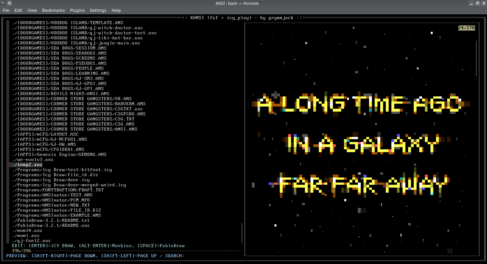

# Icy Play
Used for playing icy_anim files from Icy Draw on console/bbs. 
It's just a command line tool should be easy to build on any platform. Just set up rust on your system:
https://www.rust-lang.org/tools/install

And type "cargo build --release" - in target/release is icy_play.

That should work for all unix based OSes:
```
curl --proto '=https' --tlsv1.2 -sSf https://sh.rustup.rs | sh
git clone https://github.com/mkrueger/icy_play.git
cd icy_play
cargo build --release
sudo cp target/release/icy_play /usr/bin
```

# Usage
```
Usage: icy_play [OPTIONS] <PATH> [COMMAND]

Commands:
  play        Plays the animation (default)
  show-frame  Show a specific frame of the animation
  help        Print this message or the help of the given subcommand(s)

Arguments:
  <PATH>  File to play/show.

Options:
      --utf8         If true modern terminal output (UTF8) is used.
      --port <PORT>  Socket port address for i/o
  -h, --help         Print help
``````


# Terminal "icy view"



grymmjack found a good use case for icy_play - making an icy_view for the console.
Put icy_play in path and use this script:

``````
#requires fzf, and icy_tools
#fzf: https://github.com/junegunn/fzf
#icy_tools: https://github.com/mkrueger/icy_tools
function xansi() {
  # set paths to your ansi editors
  XANSI_EDITOR1="${XANSI_EDITOR1:-icy_draw}"
  XANSI_EDITOR2="${XANSI_EDITOR2:-moebius --no-sandbox}"
  XANSI_EDITOR3="${XANSI_EDITOR3:-PabloDraw}"

  gfind . -iregex ".*\(ans\|asc\|nfo\|txt\|me\|md\|diz\|lst\|bbs\|icy\|tnd\)$" -regextype "grep" |
    fzf \
      --ansi \
      --border-label=":: XANSI (fzf + icy_play) - by grymmjack ::" \
      --border-label-pos top \
      --no-multi \
      --separator - \
      --header "EDIT: [ENTER]=iCY DRAW, [ALT-ENTER]=Moebius, [SPACE]=PabloDraw" \
      --prompt "PREVIEW: [SHIFT-RIGHT]=PAGE DOWN, [SHIFT-LEFT]=PAGE UP / SEARCH: " \
      --border double \
      --color=dark \
      --preview="cat {} | LC_CTYPE=C tr '\a\026' '!!' > xansi.tmp && icy_play --use-lf --utf8 xansi.tmp && rm xansi.tmp" \
      --preview-window="border-sharp" \
      --bind "enter:execute-silent(${XANSI_EDITOR1} {} &)" \
      --bind "alt-enter:execute-silent(${XANSI_EDITOR2} {} &)" \
      --bind "space:execute-silent(${XANSI_EDITOR3} {} &)" \
      --bind="alt-up:preview-up" \
      --bind="alt-down:preview-down" \
      --bind="shift-left:preview-page-up" \
      --bind="shift-right:preview-page-down"
}
``````
