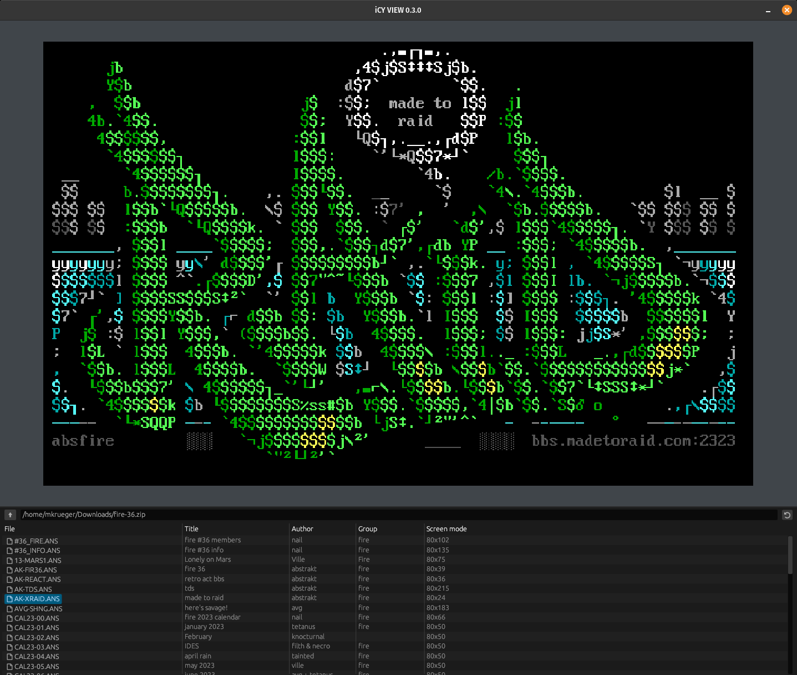

# icy_view

**The Ultimate ANSI Art Viewer** — A powerful, modern viewer for ANSI art files in the spirit of the legendary AcidView.

## ✨ What's New (December 2024 Rewrite)

After a complete reimplementation, icy_view is back and better than ever! Here's what we've built:

### 🎨 Modern UI with Three View Modes

- **Thumbnail Grid View** — Browse your collection with beautifully rendered previews
- **List View** — Classic file listing with SAUCE info columns (Title, Author, Group)
- **Full Preview Mode** — Immersive viewing with auto-hiding toolbar

### 🌐 sixteencolors.net Integration

Browse the world's largest ANSI art archive directly from icy_view! Navigate years, packs, and files as if they were local folders. Thumbnails are cached for instant browsing.

### 🎬 Shuffle Mode (Slideshow)

Press `S` to enter a mesmerizing slideshow experience:
- Random file selection from current folder/archive
- **Auto-scrolling** for tall artwork
- **SAUCE comments** fade in with smooth animations
- **Title/Author/Group overlay** with elegant styling
- **Background preloading** — next image is decoded while you're viewing the current one
- Exit anytime with Escape, Enter, or mouse click

### 📺 CRT Monitor Effects

Authentic retro feel with configurable:
- Scanlines
- Curvature
- Blur
- Saturation
- Brightness/Contrast
- Background color matching the screen

### 🖼️ Enhanced Image Support

- **Native image viewer** with smooth zoom and pan
- **Sixel image support** — view retro graphics formats
- **Auto-scroll for images** in shuffle mode
- **Preloaded image decoding** for instant transitions
### ⚡ Performance Features

- **Baud rate emulation** — watch files render like the old days (300 to 115200 baud)
- **Background file preloading** in shuffle mode
- **Efficient thumbnail caching** with GPU-accelerated rendering
- **Smart viewport scrolling** with smooth animations

### 🔧 Quality of Life

- **Unified command system** with customizable keyboard shortcuts
- **Filter popup** — quickly search files with `/` or `Ctrl+F`
- **Navigation history** with back/forward support
- **Drag-and-drop** file opening
- **Copy to clipboard** functionality
- **Full-screen mode** with `F11`
- **Multi-language support** (EN, DE, FR, ES, IT, PT, PL, HU, RO, CS, CA)

---

## 📋 Supported Formats

### ANSI/Text Art
- ANSI (.ans)
- ASCII (.asc, .txt)
- Artworx ADF (.adf)
- Avatar (.avt)
- BIN (.bin)
- XBIN (.xb)
- PCBoard (.pcb)
- iCE Draw (.idf)
- Tundra Draw (.tnd)
- Renegade (.an1, .an2, etc.)
- And many more...

### Images

- PNG, JPEG, GIF, BMP, WebP
- Sixel graphics (.six, .sixel)

### Archives (browsable as virtual folders)

Powered by [unarc-rs](https://github.com/mkrueger/unarc-rs):
- **7z** (.7z) — Full support
- **ZIP** (.zip) — Full support including legacy methods
- **RAR** (.rar) — RAR4 & RAR5
- **LHA/LZH** (.lha, .lzh) — Full support
- **ARJ** (.arj) — Methods 0-4
- **ARC** (.arc) — Classic DOS archiver
- **ZOO** (.zoo) — Methods 0, 1, 2
- **UC2** (.uc2) — UltraCompressor II
- **SQZ** (.sqz), **SQ** (.sq, .sq2), **HYP** (.hyp)
- **Z** (.Z) — Unix compress

---

## 🚀 Installation

Get the latest release from:  
**https://github.com/mkrueger/icy_tools/releases**

Available for:
- 🐧 Linux (AppImage, native binary)
- 🍎 macOS
- 🪟 Windows

---

## 🤝 Contributing

Contributions are welcome! Whether it's:
- 🐛 Bug reports
- ✨ Feature requests
- 🔧 Code contributions
- 🌍 Translations
- 📝 Documentation

If you enjoy icy_view and want to support development, donations via PayPal to mkrueger@posteo.de are appreciated!

---

## 📜 License

Licensed under either of:
- Apache License, Version 2.0
- MIT License

at your option.

---

*Made with ❤️ for the ANSI art community*
